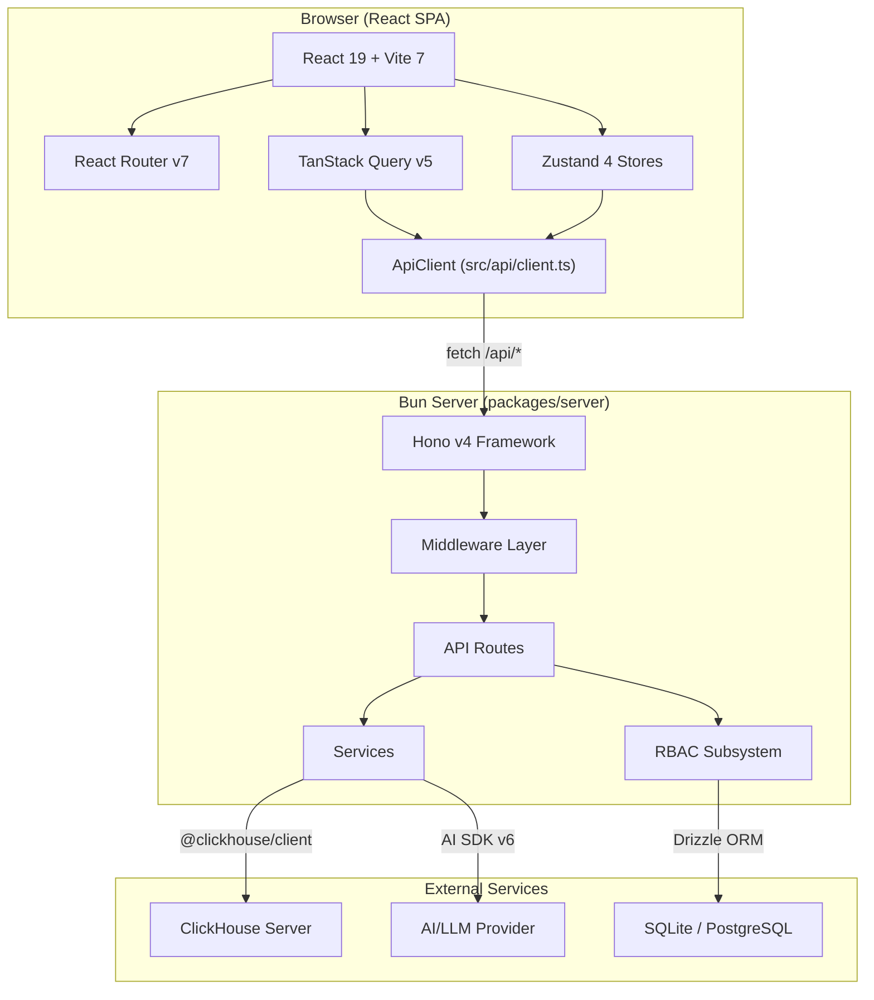
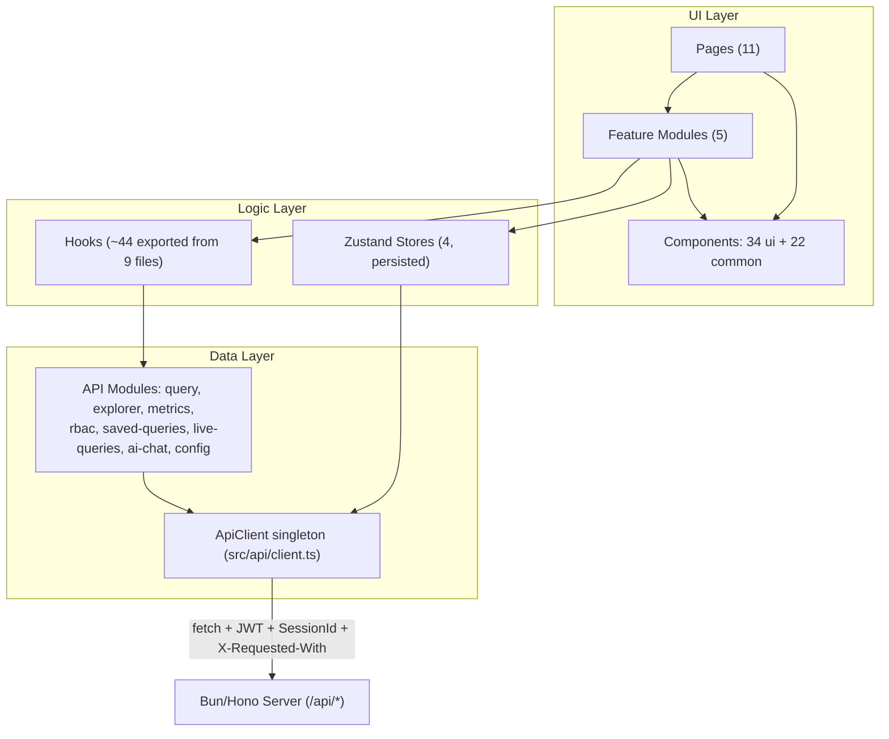
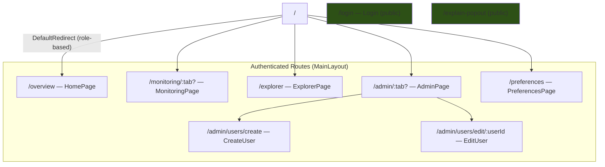
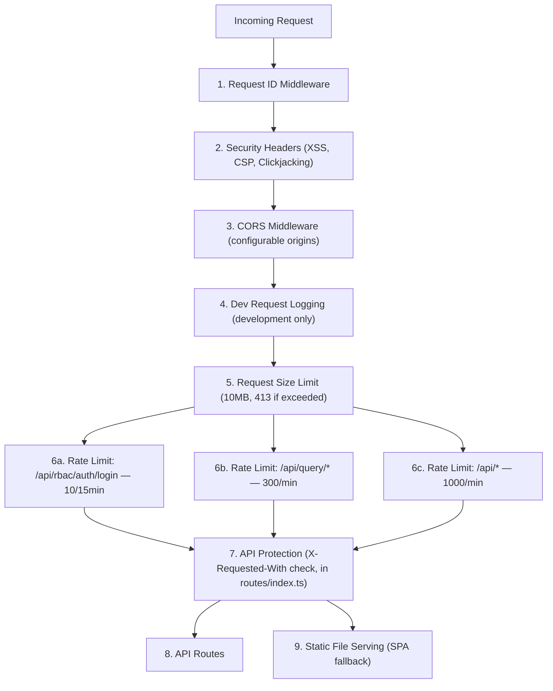
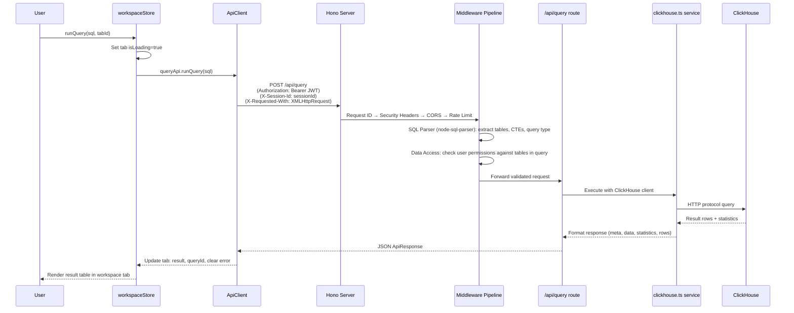
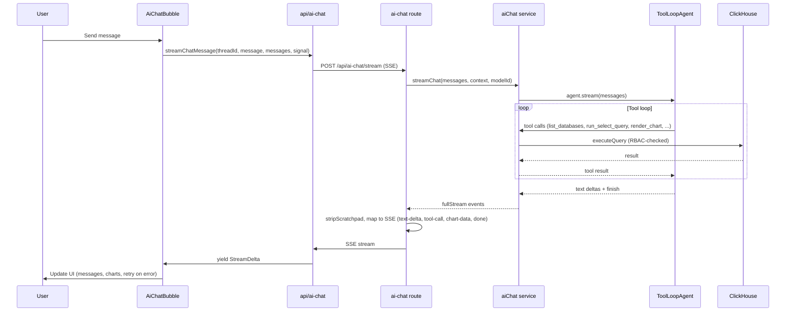

# CHouse UI — Architecture

A **ClickHouse management UI** built as a monorepo with a React 19 frontend and a Bun/Hono backend server. Provides SQL workspace, database exploration, monitoring dashboards, full RBAC user management, and AI-powered query optimization.

---

## High-Level System Architecture



---

## Frontend Architecture

### Layer Diagram



### Layer Reference

| Layer | Location | Count | Description |
|---|---|---|---|
| **Pages** | `src/pages/` | 11 files | Route-level views: Login, Home, Explorer, Monitoring, Admin, Preferences, Logs, Metrics, LiveQueries, ExplainPopout, NotFound |
| **Features** | `src/features/` | 5 modules | Domain-specific component groups with their own `components/` dirs |
| **UI Components** | `src/components/ui/` | 34 files | shadcn/ui primitives: button, dialog, dropdown-menu, tabs, data-table, select, etc. |
| **Common Components** | `src/components/common/` | 23 files | FloatingDock, Sidebar, ConnectionSelector, ErrorBoundary, PermissionGuard, DiffEditor, **ResponsiveDraggableDialog** (explorer modals: Upload file, AI debugger, AI optimizer, Create table, Create database — tablet/mobile-friendly, draggable, resizable; position/size persisted per device via user preferences), AiChatBubble, AiChartRenderer, AiChartUtils, form/InputField, etc. (tests live alongside) |
| **Sidebar** | `src/components/sidebar/` | 1 file | UserMenu component |
| **Hooks** | `src/hooks/` | 9 files | ~44 exported hooks (TanStack Query wrappers, useWindowSize, useDeviceType, preferences) |
| **Stores** | `src/stores/` | 4 stores | Zustand with `persist` middleware and user-specific storage adapters |
| **API** | `src/api/` | 9 modules | Type-safe `ApiClient` class with JWT/session management + domain modules (query, explorer, metrics, rbac, saved-queries, live-queries, ai-chat, config) |
| **Providers** | `src/providers/` | 1 file | `QueryProvider` — TanStack Query context (30s staleTime, 5min gcTime) |
| **Helpers** | `src/helpers/` | 1 file | `sqlUtils.ts` — SQL formatting and parsing utilities |
| **Utilities** | `src/utils/` | 1 file | `sessionCleanup.ts` — Session cleanup logic |
| **Lib** | `src/lib/` | 4 files | `basePath.ts`, `utils.ts`, `devicePreferences.ts`, `log.ts` — Path, utilities, per-device preference defaults and merge helpers; **log.ts** — client log helper (error/warn/info/debug, dev-only for info/debug, structured context) |
| **Types** | `src/types/` | 2 files | `env.d.ts` (global env types), `explain.ts` (EXPLAIN plan types) |
| **Tests** | `src/test/` | 3 files + mocks/ | Test setup, global setup, MSW mocks |

### Routing



**Route guards:**
- `PrivateRoute` — Requires RBAC authentication
- `AdminRoute` — Requires specific RBAC permissions (accepts `requiredPermission` prop with one or more `RBAC_PERMISSIONS`)
- Backward compatibility redirects: `/logs` → `/monitoring`, `/metrics` → `/monitoring`, `/settings` → `/preferences`

### State Management

All 4 Zustand stores use `persist` middleware with `localStorage`:

| Store | Key | Purpose |
|---|---|---|
| `authStore` | `connection-info-storage` | ClickHouse session: `sessionId`, `username`, `url`, `version`, `isAdmin`, `activeConnectionId` |
| `rbacStore` | `rbac-storage` | RBAC auth: `isAuthenticated`, `user`, `roles`, `permissions`. Actions: `login()`, `logout()`, `checkAuth()`, `hasPermission()`, `isSuperAdmin()` |
| `workspaceStore` | `workspace-storage` | Tabs array, `activeTab`. Actions: `addTab()`, `runQuery()`, `saveQuery()`, `updateSavedQuery()`. Uses user-specific storage keys. |
| `explorerStore` | `explorer-storage` | `databases[]`, `expandedNodes`, `favorites[]`, `recentItems[]`, `savedQueries[]`. Modal state. Uses user-specific storage keys. |

Both `workspaceStore` and `explorerStore` implement **user-specific storage adapters** that include the RBAC user ID in the storage key, ensuring data isolation between users.

### API Client

The `ApiClient` class (`src/api/client.ts`) is a singleton that handles:
- **Session management** — `sessionId` stored in memory + `sessionStorage`
- **JWT tokens** — Access token in `localStorage` (`rbac_access_token`), refresh token in `localStorage` (`rbac_refresh_token`)
- **Auto-refresh** — Transparent JWT refresh on 401 responses via `refreshTokens()`
- **Session recovery** — `onSessionExpired` callback in `App.tsx` automatically reconnects ClickHouse sessions
- **Request headers** — Adds `Authorization: Bearer <token>`, `X-Session-Id`, and `X-Requested-With: XMLHttpRequest` to all requests

---

## Backend Architecture

### Server Entry Point

`packages/server/src/index.ts` creates a Hono app with this middleware pipeline:



### API Routes

All mounted under `/api`:

| Route | File | Auth | Description |
|---|---|---|---|
| `/api/config` | `routes/config.ts` | Public | App configuration (env vars for frontend) |
| `/api/health` | `routes/index.ts` | Public | Health check endpoint |
| `/api/query` | `routes/query.ts` | Session | SQL query execution with SQL parsing + data access middleware |
| `/api/explorer` | `routes/explorer.ts` | Session | Database/table browsing, create/drop operations |
| `/api/metrics` | `routes/metrics.ts` | Session | System statistics, production metrics |
| `/api/saved-queries` | `routes/saved-queries.ts` | Session | CRUD for saved queries |
| `/api/live-queries` | `routes/live-queries.ts` | Session | Active query monitoring, kill queries |
| `/api/upload` | `routes/upload.ts` | Session | File upload (CSV, TSV, JSON) to tables |
| `/api/ai-chat` | `routes/ai-chat.ts` | JWT + `ai:chat` | Streaming AI chat, thread/message CRUD, status, models |
| `/api/rbac/*` | `rbac/routes/` | JWT | Full RBAC subsystem (see below) |

### Middleware

| Middleware | File | Purpose |
|---|---|---|
| **CORS** | `middleware/cors.ts` | Configurable origin, strict mode for production |
| **SQL Parser** | `middleware/sqlParser.ts` (15KB) | Uses `node-sql-parser` to parse SQL, extract CTEs, identify query type |
| **Data Access** | `middleware/dataAccess.ts` (19KB) | Row-level RBAC enforcement — checks user permissions against database/table being accessed |
| **Error Handler** | `middleware/error.ts` | Consistent error response format with `AppError` class |
| **Request ID** | `middleware/requestId.ts` | Unique request ID for tracing |

### Services

| Service | File | Size | Purpose |
|---|---|---|---|
| **ClickHouse** | `services/clickhouse.ts` | 82KB | Core query proxy — session management, query routing, format handling, statistics collection |
| **Client Manager** | `services/clientManager.ts` | 4KB | ClickHouse connection pool management |
| **AI Optimizer** | `services/aiOptimizer.ts` | 23KB | AI-powered SQL query optimization using AI SDK v6 |
| **Query Analyzer** | `services/queryAnalyzer.ts` | 24KB | EXPLAIN plan analysis and query performance insights |
| **Inference** | `services/inference.ts` | 10KB | LLM inference abstraction, supports: OpenAI, Anthropic, Google, HuggingFace, OpenAI-compatible |
| **AI Chat** | `services/aiChat.ts` | ~25KB | ToolLoopAgent with 16 tools + load_skill; streamChat() for SSE |
| **Chat History** | `services/chatHistory.ts` | ~10KB | Thread and message CRUD, 7-day retention, RBAC-scoped |
| **aiConfig** | `services/aiConfig.ts` | ~7KB | AI provider and model configuration |
| **agentSkills** | `services/agentSkills.ts` | ~3KB | Agent skills and load_skill for AI chat |

---

## RBAC Subsystem

The RBAC system (`packages/server/src/rbac/`) is a self-contained subsystem with its own routes, services, database layer, middleware, and migration system.

### RBAC Architecture

```mermaid
graph TB
    subgraph RBACRoutes["Routes (rbac/routes/)"]
        Auth["/auth — login, refresh, logout, validate, profile"]
        Users["/users — list, create, read, update, delete"]
        Roles["/roles — list, create, read, update, delete"]
        Conn["/connections — CRUD, connect, test connection"]
        Audit["/audit — list, export, delete"]
        CHUsers["/clickhouse-users — native ClickHouse user CRUD"]
        Prefs["/user-preferences — favorites, settings, expanded nodes"]
        DataAcc["/data-access — row-level access policies"]
        AIProv["/ai-providers — AI provider config"]
        AIBase["/ai-base-models — base models"]
        AIConfig["/ai-models — model configs"]
    end

    subgraph RBACMiddleware["Middleware (rbac/middleware/)"]
        JWTGuard["rbacAuth.ts — JWT auth guard (verifies access token)"]
    end

    subgraph RBACServices["Services (rbac/services/)"]
        JWTSvc["jwt.ts — Token generation/validation via jose library"]
        PassSvc["password.ts — Argon2id hashing via Bun.password"]
        RBACSvc["rbac.ts (30KB) — Core permission engine, role hierarchy"]
        ConnSvc["connections.ts (27KB) — Connection management, AES-256-GCM encryption"]
        DataAccSvc["dataAccess.ts (19KB) — Row-level access rule engine"]
        SavedQSvc["savedQueries.ts — Query persistence per user/connection"]
        CHUsersSvc["clickhouseUsers.ts (41KB) — Native ClickHouse user management"]
        UserPrefSvc["userPreferences.ts — User settings, favorites, recent items"]
        AiModelsSvc["aiModels.ts — AI base models and provider management"]
        SeedSvc["seed.ts (12KB) — Default admin, roles, permissions seeding"]
    end

    subgraph RBACDB["Database (rbac/db/)"]
        DBIndex["index.ts — Database initialization, adapter selection"]
        Migrations["migrations.ts (88KB) — Versioned schema migrations"]
    end

    subgraph RBACSchema["Schema (rbac/schema/)"]
        BaseSchema["base.ts — Abstract schema definition"]
        SQLiteSchema["sqlite.ts — SQLite-specific schema (Drizzle ORM)"]
        PostgresSchema["postgres.ts — PostgreSQL-specific schema (Drizzle ORM)"]
    end

    RBACRoutes --> RBACMiddleware
    RBACMiddleware --> RBACServices
    RBACServices --> RBACDB
    RBACDB --> RBACSchema
```



### RBAC Permission Categories

Permissions are defined in `src/stores/rbac.ts` as `RBAC_PERMISSIONS`; the frontend uses these constants for guards and AdminRoute.

| Category | Permissions |
|---|---|
| **Users** | `users:view`, `users:create`, `users:update`, `users:delete` |
| **Roles** | `roles:view`, `roles:create`, `roles:update`, `roles:delete`, `roles:assign` |
| **ClickHouse Users** | `clickhouse:users:view`, `clickhouse:users:create`, `clickhouse:users:update`, `clickhouse:users:delete` |
| **Database** | `database:view`, `database:create`, `database:drop` |
| **Tables** | `table:view`, `table:create`, `table:alter`, `table:drop`, `table:select`, `table:insert`, `table:update`, `table:delete` |
| **Query** | `query:execute`, `query:execute:ddl`, `query:execute:dml`, `query:history:view`, `query:history:view:all` |
| **Saved Queries** | `saved_queries:view`, `saved_queries:create`, `saved_queries:update`, `saved_queries:delete`, `saved_queries:share` |
| **Metrics** | `metrics:view`, `metrics:view:advanced` |
| **Settings** | `settings:view`, `settings:update` |
| **Audit** | `audit:view`, `audit:export`, `audit:delete` |
| **Live Queries** | `live_queries:view`, `live_queries:kill`, `live_queries:kill_all` |
| **Connections** | `connections:view`, `connections:edit`, `connections:delete` |
| **AI** | `ai:optimize`, `ai:chat` |
| **AI Models** | `ai_models:view`, `ai_models:create`, `ai_models:update`, `ai_models:delete` |

### Default Roles

| Role | Priority | Description |
|---|---|---|
| **Super Admin** | 100 | All permissions, cannot be deleted |
| **Admin** | 90 | User/role/connection management |
| **Developer** | 70 | Write access (insert, DDL, alter) |
| **Analyst** | 50 | Read access (select, export) |
| **Viewer** | 30 | Read-only (select only) |
| **Guest** | 10 | Minimal read-only access |

---

## Data Flow: Query Execution



### Data Flow: AI Chat

Streaming chat uses RBAC (`ai:chat` permission), session or RBAC connection for ClickHouse, and per-user stream rate limit (30/min). Threads and messages are persisted via Chat History (7-day retention).



---

## Project File Structure

```
chouse-ui/
├── src/                              # React Frontend (SPA)
│   ├── App.tsx                       # Root: routing, session recovery, MainLayout
│   ├── main.tsx                      # Entry: StrictMode, ErrorBoundary, QueryProvider, Toaster
│   ├── index.css                     # Global styles (Tailwind CSS v4)
│   ├── vite-env.d.ts                 # Vite environment type declarations
│   │
│   ├── pages/                        # 11 route-level page components
│   │   ├── Home.tsx                  # Overview dashboard (30KB)
│   │   ├── Admin.tsx                 # Admin panel with tabs
│   │   ├── Explorer.tsx              # Database explorer
│   │   ├── Monitoring.tsx            # Monitoring with sub-tabs (logs, metrics, live queries)
│   │   ├── Preferences.tsx           # User preferences (26KB)
│   │   ├── Login.tsx                 # Login page
│   │   ├── Logs.tsx                  # Query logs (41KB)
│   │   ├── Metrics.tsx               # Metrics dashboard (108KB)
│   │   ├── LiveQueries.tsx           # Active query monitoring (25KB)
│   │   ├── ExplainPopout.tsx         # Standalone EXPLAIN view (17KB)
│   │   └── NotFound.tsx              # 404 page
│   │
│   ├── features/                     # 5 domain-specific feature modules
│   │   ├── admin/
│   │   │   ├── components/           # AiModels/, ClickHouseUsers/, ConnectionManagement/, CreateUser/, EditUser/, UserDataAccess/, UserManagement/
│   │   │   └── routes/               # adminRoute.tsx
│   │   ├── explorer/
│   │   │   └── components/           # AlterTable, CreateDatabase, CreateTable, DataExplorer, TreeNode, ImportWizard/, etc.
│   │   ├── workspace/
│   │   │   ├── components/           # SqlTab, HomeTab, ExplainTab, ASTView, PipelineView, VisualExplain, WorkspaceTabs, etc.
│   │   │   └── editor/               # Monaco editor integration
│   │   ├── rbac/
│   │   │   └── components/           # Permission guard components
│   │   └── metrics/
│   │       └── components/           # uPlot chart wrappers, uplot.css
│   │
│   ├── components/
│   │   ├── ui/                       # 34 shadcn/ui primitives (Radix-based)
│   │   │                             # accordion, alert-dialog, badge, button, calendar, card,
│   │   │                             # checkbox, collapsible, command, context-menu, data-table,
│   │   │                             # dialog, dropdown-menu, form, glass-card, input, label,
│   │   │                             # multi-step-loader, popover, progress, radio-group, resizable,
│   │   │                             # scroll-area, select, separator, sheet, skeleton, sonner,
│   │   │                             # switch, table, tabs, textarea, tooltip
│   │   ├── common/                   # 23 shared app components
│   │   │   ├── FloatingDock.tsx       # Main navigation dock (34KB)
│   │   │   ├── ResponsiveDraggableDialog.tsx # Explorer modals: draggable, resizable, tablet/mobile; prefs persisted
│   │   │   ├── Sidebar.tsx            # Sidebar navigation
│   │   │   ├── ConnectionSelector.tsx # ClickHouse connection switcher (17KB)
│   │   │   ├── ErrorBoundary.tsx      # React error boundary
│   │   │   ├── PermissionGuard.tsx    # RBAC permission wrapper
│   │   │   ├── RestrictedRoute.tsx    # Route access control
│   │   │   ├── privateRoute.tsx       # Auth-required route wrapper
│   │   │   ├── DefaultRedirect.tsx    # Role-based redirect logic
│   │   │   ├── AppInit.tsx            # App initialization (auth check)
│   │   │   ├── PageTitleUpdater.tsx   # Dynamic page titles
│   │   │   ├── theme-provider.tsx     # Dark/light theme
│   │   │   ├── AgTable.tsx            # AG Grid wrapper
│   │   │   ├── ConfirmationDialog.tsx # Confirm action dialog
│   │   │   ├── DataControls.tsx       # Data table controls
│   │   │   ├── DebugQueryDialog.tsx   # SQL debug dialog (21KB)
│   │   │   ├── DiffEditor.tsx         # Monaco diff editor
│   │   │   ├── DownloadDialog.tsx     # Data export dialog
│   │   │   ├── InfoDialog.tsx         # Information dialog
│   │   │   ├── OptimizeQueryDialog.tsx # AI optimizer dialog (21KB)
│   │   │   ├── AiChatBubble.tsx       # AI chat UI in MainLayout
│   │   │   ├── AiChartRenderer.tsx    # AI chart rendering
│   │   │   ├── AiChartUtils.ts        # Chart utilities
│   │   │   └── form/                  # Form components (InputField, etc.)
│   │   └── sidebar/
│   │       └── UserMenu.tsx           # User avatar menu
│   │
│   ├── stores/                       # 4 Zustand stores (all persisted to localStorage)
│   │   ├── index.ts                  # Barrel exports
│   │   ├── auth.ts                   # ClickHouse connection/session state
│   │   ├── rbac.ts                   # RBAC auth, roles, permissions, ~40 permission constants
│   │   ├── workspace.ts              # Tabs, query execution, saved queries
│   │   └── explorer.ts              # DB tree, favorites, recent items, modal state (888 lines)
│   │
│   ├── hooks/                        # 9 hook files exporting ~44 hooks
│   │   ├── index.ts                  # Barrel exports
│   │   ├── useQuery.ts               # ~30 TanStack Query hooks (1307 lines)
│   │   ├── useAuth.ts                # useAuth, useRequireAuth, useRequireAdmin, usePermission
│   │   ├── useLiveQueries.ts         # useLiveQueries, useKillQuery
│   │   ├── useDebounce.ts            # Debounce utility hook
│   │   ├── useWindowSize.ts          # Window size hook
│   │   ├── useDeviceType.ts          # Device type (mobile/desktop)
│   │   ├── useLogsPreferences.ts     # Logs page preferences
│   │   ├── usePaginationPreferences.ts # Table pagination preferences
│   │   └── useUserManagementPreferences.ts # Admin page preferences
│   │
│   ├── api/                          # API client layer (9 modules)
│   │   ├── index.ts                  # Barrel exports
│   │   ├── client.ts                 # ApiClient class: session mgmt, JWT, auto-refresh (367 lines)
│   │   ├── query.ts                  # SQL execution, format handling
│   │   ├── explorer.ts               # Database/table CRUD
│   │   ├── metrics.ts                # System stats, production metrics
│   │   ├── rbac.ts                   # RBAC API: auth, users, roles, connections, audit, preferences (1494 lines)
│   │   ├── saved-queries.ts          # Saved query CRUD
│   │   ├── live-queries.ts           # Active query operations
│   │   ├── ai-chat.ts                # Streaming AI chat, thread/message CRUD
│   │   └── config.ts                 # App configuration
│   │
│   ├── providers/
│   │   └── QueryProvider.tsx         # TanStack Query client (retry: 3, staleTime: 30s, gcTime: 5min)
│   │
│   ├── helpers/
│   │   └── sqlUtils.ts               # SQL formatting/parsing utilities (10KB)
│   │
│   ├── lib/
│   │   ├── basePath.ts               # Base path resolution
│   │   ├── utils.ts                  # General utilities (cn() for class merging)
│   │   └── devicePreferences.ts       # Per-device preference defaults and merge helpers
│   │
│   ├── types/
│   │   ├── env.d.ts                  # Global environment type declarations
│   │   └── explain.ts                # EXPLAIN plan types (9KB)
│   │
│   ├── utils/
│   │   └── sessionCleanup.ts         # Session cleanup utilities (6KB)
│   │
│   └── test/
│       ├── setup.ts                  # Vitest setup
│       ├── globalSetup.ts            # Global test setup
│       └── mocks/                    # MSW mock handlers
│
├── packages/server/                  # Bun/Hono Backend Server
│   ├── package.json                  # @chouseui/server v2.12.3
│   ├── tsconfig.json
│   └── src/
│       ├── index.ts                  # Server entry (353 lines): middleware pipeline, static serving, graceful shutdown
│       │
│       ├── routes/                   # 9 API route modules (all under /api)
│       │   ├── index.ts              # Route mounting + API protection middleware
│       │   ├── query.ts              # /query — SQL execution (43KB)
│       │   ├── explorer.ts           # /explorer — DB/table browsing (22KB)
│       │   ├── metrics.ts            # /metrics — System statistics (16KB)
│       │   ├── saved-queries.ts      # /saved-queries — Query persistence (9KB)
│       │   ├── live-queries.ts       # /live-queries — Active query monitoring (16KB)
│       │   ├── upload.ts             # /upload — File import to tables (6KB)
│       │   ├── ai-chat.ts            # /ai-chat — Streaming AI chat, thread/message CRUD
│       │   └── config.ts             # /config — App configuration (1KB)
│       │
│       ├── services/                 # Business logic services
│       │   ├── clickhouse.ts         # ClickHouse query proxy + session mgmt (82KB)
│       │   ├── clientManager.ts      # ClickHouse client connection pool (4KB)
│       │   ├── aiOptimizer.ts        # AI-powered query optimization (23KB)
│       │   ├── queryAnalyzer.ts      # EXPLAIN plan analysis (24KB)
│       │   ├── inference.ts          # LLM inference abstraction (10KB)
│       │   ├── aiChat.ts             # ToolLoopAgent, streamChat (25KB)
│       │   ├── chatHistory.ts        # Thread/message CRUD, 7-day retention (10KB)
│       │   ├── aiConfig.ts           # AI provider/model configuration
│       │   └── agentSkills.ts        # Agent skills, load_skill for AI chat
│       │
│       ├── middleware/               # Server middleware
│       │   ├── cors.ts               # CORS with configurable origins (5KB)
│       │   ├── sqlParser.ts          # SQL parsing via node-sql-parser (15KB)
│       │   ├── dataAccess.ts         # Row-level RBAC enforcement (19KB)
│       │   ├── error.ts              # AppError class + error handler (2KB)
│       │   └── requestId.ts          # Unique request ID generation
│       │
│       ├── rbac/                     # Full RBAC subsystem
│       │   ├── index.ts              # RBAC initialization + route exports
│       │   ├── cli.ts                # CLI tools: status, migrate, seed, reset, version
│       │   ├── routes/               # 11 route groups (auth, users, roles, connections, audit, clickhouse-users, data-access, user-preferences, ai-providers, ai-base-models, ai-models)
│       │   │   ├── auth.ts           # Login, refresh, logout, validate, profile
│       │   │   ├── users.ts          # User CRUD
│       │   │   ├── roles.ts          # Role CRUD
│       │   │   ├── connections.ts    # Connection management (21KB)
│       │   │   ├── audit.ts          # Audit log viewing/export
│       │   │   ├── clickhouseUsers.ts # Native ClickHouse user management (19KB)
│       │   │   ├── dataAccess.ts     # Row-level access policies (14KB)
│       │   │   ├── userPreferences.ts # User favorites, settings
│       │   │   ├── aiProviders.ts    # /ai-providers — AI provider config
│       │   │   ├── aiModels.ts       # /ai-base-models — base models
│       │   │   └── aiConfigs.ts      # /ai-models — model configs
│       │   ├── services/             # 10 service files
│       │   │   ├── rbac.ts           # Core permission engine (30KB)
│       │   │   ├── jwt.ts            # JWT via jose library (7KB)
│       │   │   ├── password.ts       # Argon2id via Bun.password (3KB)
│       │   │   ├── connections.ts    # Connection management + AES-256-GCM (27KB)
│       │   │   ├── clickhouseUsers.ts # ClickHouse user service (41KB)
│       │   │   ├── dataAccess.ts     # Access rule engine (19KB)
│       │   │   ├── savedQueries.ts   # Query persistence (7KB)
│       │   │   ├── userPreferences.ts # User settings (11KB)
│       │   │   ├── aiModels.ts       # AI base models and provider management
│       │   │   └── seed.ts           # Default data seeding (12KB)
│       │   ├── db/                   # Database layer
│       │   │   ├── index.ts          # DB initialization + adapter selection (9KB)
│       │   │   └── migrations.ts     # Versioned schema migrations (88KB)
│       │   ├── schema/               # Database schemas (Drizzle ORM)
│       │   │   ├── base.ts           # Abstract schema definition (8KB)
│       │   │   ├── sqlite.ts         # SQLite schema (20KB)
│       │   │   └── postgres.ts       # PostgreSQL schema (20KB)
│       │   └── middleware/
│       │       └── rbacAuth.ts       # JWT auth guard middleware (8KB)
│       │
│       ├── types/                    # Server type definitions
│       └── utils/                    # Server utilities
│
├── docs/                             # Documentation site (42 files)
├── scripts/                          # Build/test scripts
├── Dockerfile                        # Production container image
├── docker-compose.yml                # Development/deployment stack
├── components.json                   # shadcn/ui configuration
├── vite.config.ts                    # Vite config with @/ alias, proxy to :5521
├── vitest.config.ts                  # Vitest with jsdom
├── tsconfig.json                     # TypeScript strict mode
├── eslint.config.js                  # ESLint configuration
├── CHANGELOG.md                      # Version history
└── package.json                      # Monorepo root (Bun workspaces)
```

---

## Tech Stack

| Layer | Technology | Version | Purpose |
|---|---|---|---|
| **Frontend Framework** | React | 19.2 | UI library |
| **Build Tool** | Vite | 7.2.6 | Dev server + bundler |
| **Styling** | Tailwind CSS | 4.1.17 | Utility-first CSS |
| **UI Components** | shadcn/ui + Radix UI | — | Accessible component primitives |
| **Client State** | Zustand | 5.0 | Lightweight global state with persistence |
| **Server State** | TanStack Query | 5.90 | Data fetching, caching, sync |
| **Routing** | React Router | 7.10 | Client-side routing |
| **Code Editor** | Monaco Editor | 0.53 | SQL editor with syntax highlighting |
| **Data Grid** | AG Grid | 34.3 | High-performance data table |
| **Tables** | TanStack Table | 8.21 | Headless table logic |
| **Charts** | Recharts + uPlot | 3.6 / 1.6 | Dashboard visualizations |
| **Animations** | Framer Motion | 12.23 | UI animations |
| **Flow Diagrams** | React Flow | 11.11 | EXPLAIN plan visualization |
| **Forms** | React Hook Form + Zod | 7.67 / 4.1 | Form management + validation |
| **Drag & Drop** | dnd-kit | 6.3 | Tab reordering |
| **Backend Runtime** | Bun | 1.0+ | JavaScript runtime |
| **Backend Framework** | Hono | 4.11 | Lightweight web framework |
| **ClickHouse Client** | @clickhouse/client | 1.16 | Native ClickHouse driver (server) |
| **ClickHouse Client** | @clickhouse/client-web | 1.8 | Browser ClickHouse client (frontend) |
| **ORM** | Drizzle ORM | 0.38 | Type-safe SQL for RBAC database |
| **JWT** | jose | 5.9 | Token generation and validation |
| **Password** | Bun.password (Argon2id) | — | Secure password hashing |
| **AI SDK** | Vercel AI SDK | 6.0 | Multi-provider LLM integration |
| **AI Providers** | OpenAI, Anthropic, Google, HuggingFace, OpenAI-compatible | — | Pluggable AI backends |
| **SQL Parser** | node-sql-parser | 5.3 | SQL analysis for data access control |
| **Logging (Server)** | Pino | 10.x | JSON logging, levels, request-scoped child loggers (`utils/logger.ts`) |
| **Rate Limiting** | hono-rate-limiter | 0.5 | Request throttling |
| **Validation (Server)** | Zod + @hono/zod-validator | 3.23 | Request schema validation |
| **Validation (Frontend)** | Zod | 4.1 | Form and data validation |
| **PostgreSQL** | postgres (porsager/postgres) | 3.4 | PostgreSQL driver for RBAC |
| **Testing** | Vitest + Testing Library + MSW | 3.2 | Unit/integration testing |
| **Package Manager** | Bun | — | Monorepo workspaces |
