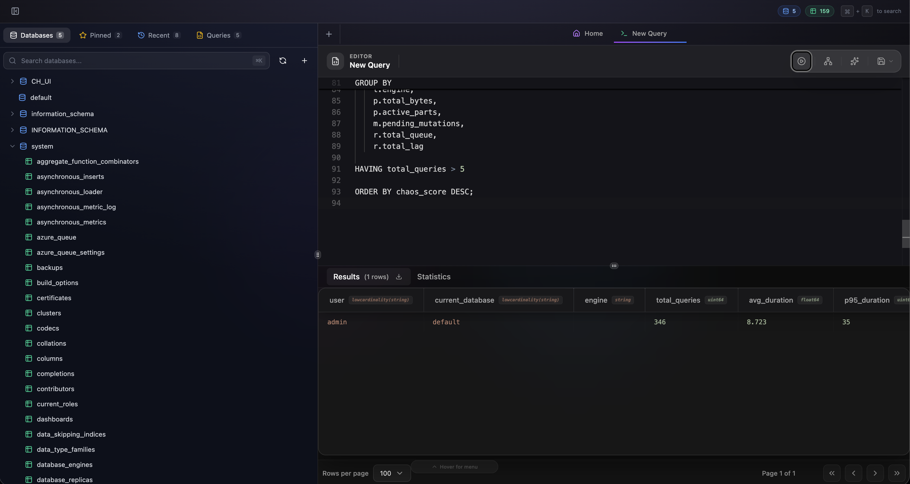
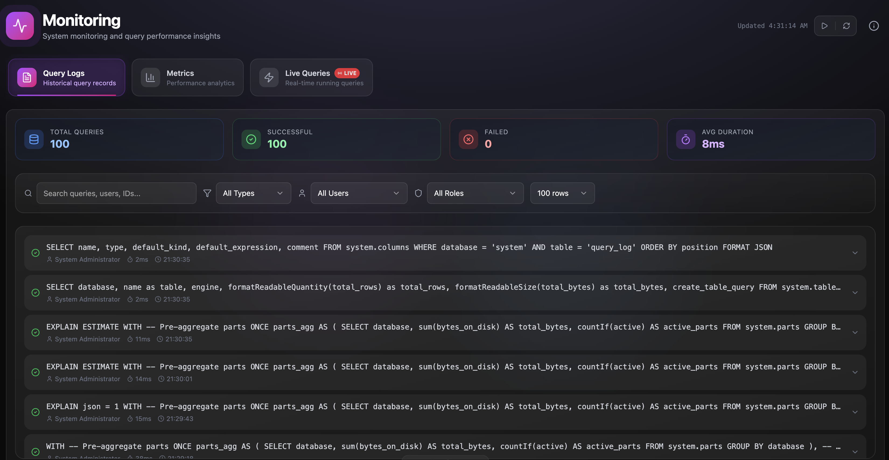
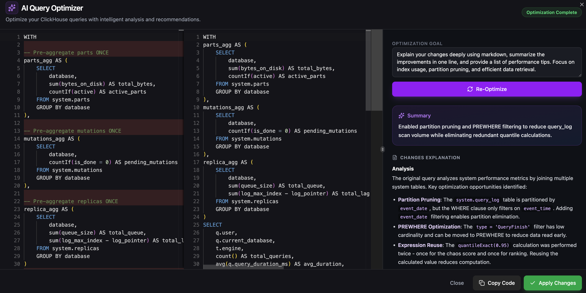
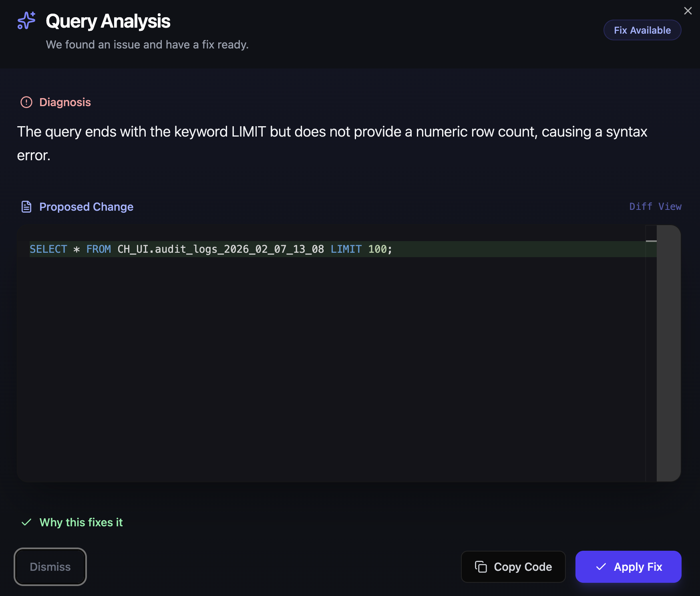
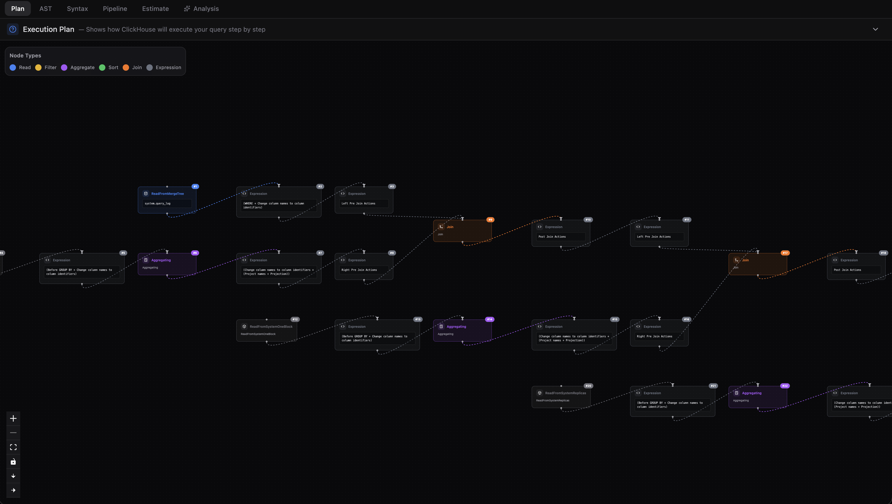
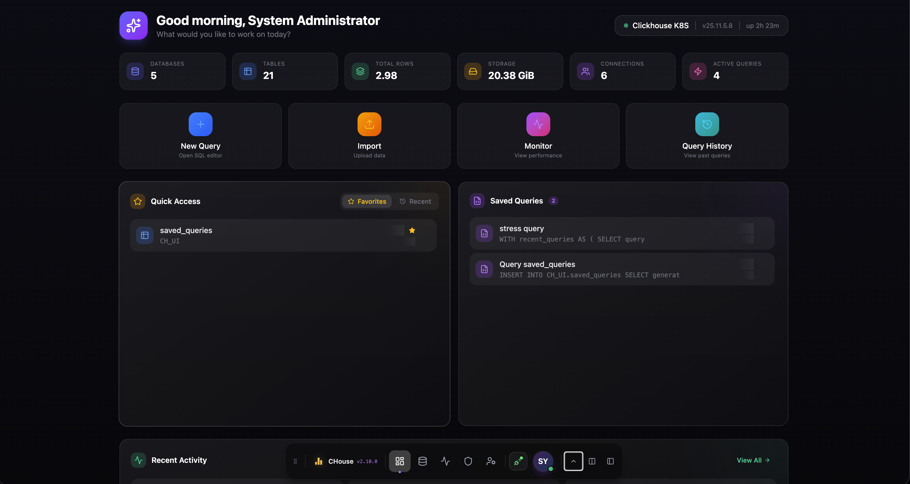
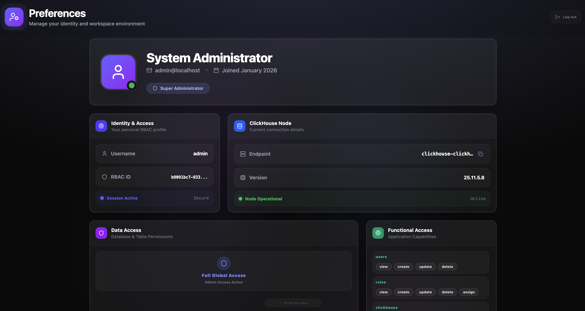
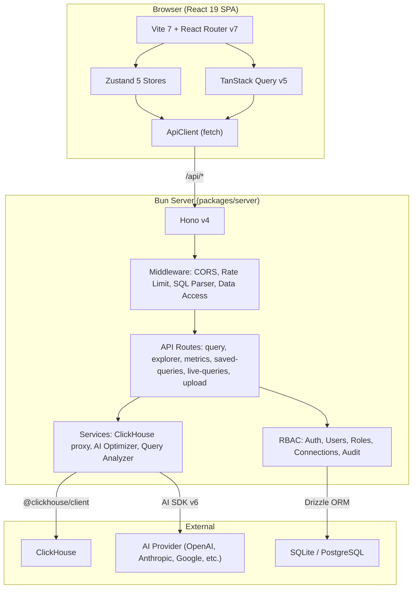

<p align="center">
  
</p>

<h1 align="center">CHouse UI</h1>

<p align="center">
  <strong>A web interface for ClickHouse with built-in RBAC</strong>
</p>

<p align="center">
  <a href="#features">Features</a> •
  <a href="#architecture">Architecture</a> •
  <a href="#quick-start">Quick Start</a> •
  <a href="#deployment">Deployment</a> •
  <a href="#configuration">Configuration</a>
</p>

<p align="center">
  <a href="https://chouse-ui.com">
    
  </a>
  <a href="https://github.com/daun-gatal/chouse-ui/actions/workflows/ci.yml">
    
  </a>
  <a href="https://github.com/daun-gatal/chouse-ui/actions/workflows/github-pages.yml">
    
  </a>
  <a href="https://github.com/daun-gatal/chouse-ui/actions/workflows/release.yml">
    
  </a>
</p>

---

## Overview

CHouse UI is a web interface for managing ClickHouse databases with server-side credential management and **Role-Based Access Control (RBAC)**. Credentials are stored encrypted on the server, and access is controlled through a permission system.

### Why CHouse UI?

CHouse UI provides security and access control features for teams that need:

| Feature | CHouse UI |
|---------|-------------------|
| **Credential Management** | Encrypted server-side storage (never in browser) |
| **Architecture** | Secure backend proxy (no direct browser-to-ClickHouse) |
| **Access Control** | Full RBAC with granular permissions |
| **Multi-Connection** | Manage multiple ClickHouse servers |
| **Audit Trail** | Audit logging |

> **Note**: Other ClickHouse tools serve different use cases well. CHouse UI is designed specifically for teams requiring centralized credential management, role-based access control, and audit capabilities.

---

## Features

### 🔐 Security & Access Control
- **RBAC System** - Role-based permissions (Super Admin, Admin, Developer, Analyst, Viewer, Guest)
- **ClickHouse User Management** - Create and manage ClickHouse users with native grants (Developer, Analyst, Viewer roles)
- **Encrypted Credentials** - AES-256-GCM encryption for ClickHouse connection passwords
- **Password Hashing** - Argon2id for user passwords
- **JWT Authentication** - Secure token-based sessions with access and refresh tokens
- **Data Access Rules** - Granular database/table permissions per user or role
- **Audit Logging** - Track all user actions and query history
- **AI-Powered Analysis** - Built-in query optimizer and debugger to improve performance and security

### 🗄️ Database Management
- **Multi-Connection Support** - Manage multiple ClickHouse servers
- **Database Explorer** - Tree view with schema inspection
- **Database Operations** - Create and drop databases
- **Table Management** - Create, alter, and drop tables with various engines (MergeTree, ReplicatedMergeTree, etc.)
- **File Upload** - Upload CSV, TSV, or JSON files to existing tables
- **Data Preview** - Sample data with pagination

### 📊 Query & Analytics
- **SQL Editor** - Monaco editor with syntax highlighting and auto-completion
- **Query Execution** - Run queries with execution statistics
- **Query History** - View and filter query logs with auto-refresh
- **Saved Queries** - Persist frequently used queries
- **Data Export** - CSV, JSON, TSV formats
- **Real-time Metrics** - System monitoring dashboard with charts
- **Overview Dashboard** - System stats, recent queries, and quick actions (admin only)

### 🎨 User Experience
- **Modern UI** - Glassmorphism design with dark theme
- **Responsive** - Works on desktop and tablet
- **Connection Selector** - Quick server switching
- **Keyboard Shortcuts** - Power user support

---

## Screenshots

### 🚀 SQL Workspace


### ✨ Core Features
<table width="100%">
  <tr>
    <td width="25%" align="center"><b>Analytics</b></td>
    <td width="25%" align="center"><b>Optimization</b></td>
    <td width="25%" align="center"><b>Debugging</b></td>
    <td width="25%" align="center"><b>Visualization</b></td>
  </tr>
  <tr>
    <td></td>
    <td></td>
    <td></td>
    <td></td>
  </tr>
</table>

---

<details>
<summary><b>🛠️ Management & Administration</b></summary>

| Dashboard | Admin | Preferences |
|:---:|:---:|:---:|
|  |  |  |

</details>

## Quick Start

### Prerequisites

- [Bun](https://bun.sh/) v1.0+ (or Node.js 18+)
- A ClickHouse server (or use Docker Compose)

### Tested Compatibility

Successfully tested with:
- **ClickHouse**: Version 25
- **PostgreSQL**: Version 18 (for RBAC database)
- **SQLite**: Version 3.51.0 (via Bun, for RBAC database)

### Development Setup

```bash
# Clone the repository
git clone https://github.com/daun-gatal/chouse-ui.git
cd chouse-ui

# Install dependencies
bun install

# Start development servers
bun run dev
```

This starts:
- **Frontend**: http://localhost:5173
- **Backend**: http://localhost:5521

### Default Login

On first run, an admin user is created:
- **Email**: `admin@localhost`
- **Username**: `admin`
- **Password**: `admin123!`

> ⚠️ **Change this password immediately in production!**

---

### Deployment (Docker)

```bash
# Clone the repository
git clone https://github.com/daun-gatal/chouse-ui.git
cd chouse-ui

# Run with Docker Compose
docker-compose up -d
```

Access at http://localhost:5521

#### Production Deployment

For production, we recommend using an external highly-available PostgreSQL database for RBAC storage. See the [Configuration](#configuration) section for details on how to configure `RBAC_POSTGRES_URL`.

---

## Configuration

CHouse UI can be configured using environment variables (`.env` file) or through a grouped YAML configuration file.

### YAML Configuration (Recommended)

You can set all configuration options via a hierarchical YAML file. To use this, set the `CHOUSE_CONFIG_PATH` environment variable pointing to your YAML file:

```bash
CHOUSE_CONFIG_PATH=./config.yaml bun run packages/server/src/index.ts
```

The YAML keys map directly to the environment variables by converting the nested paths to uppercase and joining with underscores. For example:
```yaml
port: 5521
node_env: production
rbac:
  db_type: sqlite
  sqlite_path: ./data/rbac.db
  encryption:
    key: your-secret-key
ai:
  provider: openai
```

### Environment Variables

#### Core Settings

| Variable | Description | Default |
|----------|-------------|---------|
| `PORT` | Server port | `5521` |
| `NODE_ENV` | Environment (`development`/`production`) | `development` |
| `CORS_ORIGIN` | Allowed CORS origins (comma-separated or `*`) | `*` |
| `STATIC_PATH` | Path to frontend build | `./dist` |
| `CHOUSE_CONFIG_PATH` | Path to optional YAML configuration file | - |

#### RBAC Database

| Variable | Description | Default |
|----------|-------------|---------|
| `RBAC_DB_TYPE` | Database type (`sqlite`/`postgres`) | `sqlite` |
| `RBAC_SQLITE_PATH` | SQLite file path | `./data/rbac.db` |
| `RBAC_POSTGRES_URL` | PostgreSQL connection URL (or use `DATABASE_URL`) | - |
| `RBAC_POSTGRES_POOL_SIZE` | Connection pool size for PostgreSQL | `10` |

**PostgreSQL Permissions**: When using PostgreSQL, the database user specified in `RBAC_POSTGRES_URL` must have the following permissions:
- `CREATEDB` privilege to create the database if it doesn't exist
- Or the database must already exist and the user must have `CONNECT` and `CREATE` privileges on it

The application will automatically create the database if it doesn't exist. To grant the required permissions:

```sql
-- Grant CREATEDB privilege (allows creating databases)
ALTER USER your_user WITH CREATEDB;

-- Or if the database already exists, grant privileges on it
GRANT CONNECT, CREATE ON DATABASE your_database TO your_user;
```

#### Authentication (JWT)

| Variable | Description | Default |
|----------|-------------|---------|
| `JWT_SECRET` | JWT signing secret | **Required** |
| `JWT_ACCESS_EXPIRY` | Access token expiry (e.g., `15m`, `4h`) | `4h` |
| `JWT_REFRESH_EXPIRY` | Refresh token expiry (e.g., `7d`) | `7d` |
| `RBAC_ADMIN_EMAIL` | Initial admin email | `admin@localhost` |
| `RBAC_ADMIN_USERNAME` | Initial admin username | `admin` |
| `RBAC_ADMIN_PASSWORD` | Initial admin password | `admin123!` |

#### Security & Encryption

| Variable | Description | Default |
|----------|-------------|---------|
| `RBAC_ENCRYPTION_KEY` | AES-256 key for passwords (32-byte hex) | **Required** |
| `RBAC_ENCRYPTION_SALT` | Salt for key derivation (32-byte hex) | **Required** |


### Generating Secrets

```bash
# Generate JWT secret
openssl rand -base64 32

# Generate encryption key
openssl rand -hex 32

# Generate strong password
openssl rand -base64 16
```

---

## RBAC System

### How RBAC Works

CHouse UI has its **own permission system** that controls access to the web interface.

**Two separate things:**

1. **CHouse UI RBAC** (for the web interface):
   - Controls who can use CHouse UI and what they can do
   - Stored in CHouse UI's own database
   - All queries are checked against these permissions before reaching ClickHouse

2. **ClickHouse User Management** (optional feature):
   - CHouse UI can create ClickHouse users with native grants
   - These are actual ClickHouse users (not CHouse UI users)
   - Useful if you want to manage ClickHouse users through the web interface

**In simple terms:** CHouse UI's RBAC controls access to the web interface. It can also optionally create ClickHouse users, but that's a separate feature.

### Role Hierarchy

| Role | Description | Key Permissions |
|------|-------------|-----------------|
| **Super Admin** | Full system access | All permissions |
| **Admin** | Server management | Users, roles, connections |
| **Developer** | Write access | Insert, update, DDL |
| **Analyst** | Read access | Select, export |
| **Viewer** | Read-only | Select only |
| **Guest** | Read-only access | View all tabs, read-only queries, system tables access |

### Data Access Rules

Control access to specific databases and tables:

```
Rule: Allow "analyst" role to access "analytics.*"
Rule: Deny "viewer" role from "system.*"
Rule: Allow user "john" to access "sales.orders"
```

Features:
- **Wildcards**: `*` matches any database/table
- **Patterns**: Regex support for complex rules
- **Deny Rules**: Explicit denials take precedence
- **Priority**: Higher priority rules evaluated first

### Permission Categories

- **User Management**: Create, update, delete users
- **Role Management**: Manage roles and permissions
- **Connection Management**: Add/edit ClickHouse connections
- **Query Operations**: Execute queries, DML, DDL
- **Table Operations**: Select, insert, update, delete
- **System**: Audit logs, settings

---

## Architecture

CHouse UI is a monorepo with two main packages:

- **Frontend** (`src/`) — React 19 + Vite SPA with Zustand stores, TanStack Query, and shadcn/ui
- **Backend** (`packages/server/`) — Bun + Hono API server with RBAC, ClickHouse proxy, and AI optimizer



> 📖 **[Full architecture documentation →](ARCHITECTURE.md)** — Detailed diagrams for frontend layers, backend services, RBAC subsystem, data flows, permissions catalog, and complete file structure with sizes.

---

## Security

### Reporting Vulnerabilities

If you discover a security vulnerability, please see [SECURITY.md](SECURITY.md) for information on how to report it responsibly.

### Production Checklist

- [ ] Generate unique `JWT_SECRET` (min 32 bytes)
- [ ] Generate unique `RBAC_ENCRYPTION_KEY` (32 bytes hex)
- [ ] Generate unique `RBAC_ENCRYPTION_SALT` (32 bytes hex)
- [ ] Change default admin password
- [ ] Set `CORS_ORIGIN` to your domain
- [ ] Use PostgreSQL for multi-instance deployments
- [ ] Enable HTTPS via reverse proxy
- [ ] Configure firewall rules
- [ ] Set up regular backups

### Security Features

| Feature | Description |
|---------|-------------|
| **No Browser Credentials** | ClickHouse passwords never reach the frontend |
| **Encrypted Storage** | AES-256-GCM for ClickHouse connection passwords |
| **Password Hashing** | Argon2id for user passwords |
| **JWT Tokens** | Short-lived access tokens, long-lived refresh tokens |
| **RBAC Enforcement** | Every request checked against permissions |
| **Query Validation** | SQL parsed and validated against data access rules |
| **Audit Logging** | All actions logged with user context |

---

## Database Migrations

### Automatic Migrations

**Migrations run automatically on server startup.** No manual intervention required.

```
Server Start
    │
    ▼
initializeRbac()
    │
    ├── Check current DB version
    ├── Run pending migrations (if any)
    └── Seed defaults (first run only)
```

| Scenario | What Happens |
|----------|--------------|
| **Fresh install** | Creates full schema → Seeds roles, permissions, admin user |
| **Version upgrade** | Detects version diff → Applies only pending migrations |
| **Normal restart** | Version matches → No migrations needed |

### Manual Migration (Optional)

For advanced scenarios (pre-flight checks, debugging), use CLI tools:

```bash
cd packages/server

# Check current status and pending migrations
bun run rbac:status

# Output example:
# Current version: 1.1.0
# Target version: 1.2.0
# Pending migrations:
#   - 1.2.0: user_data_access_rules

# Run migrations manually
bun run rbac:migrate

# Check version only
bun run rbac:version

# Seed default data (if missing)
bun run rbac:seed

# Reset database (⚠️ DESTRUCTIVE - deletes all data!)
CONFIRM_RESET=yes bun run rbac:reset
```

### Upgrading CHouse UI

```bash
# 1. Pull latest version
docker pull ghcr.io/daun-gatal/chouse-ui:latest

# 2. Restart container - migrations run automatically
docker-compose up -d

# 3. Check logs for migration status
docker logs chouse-ui | grep RBAC
```

Expected output on upgrade:
```
[RBAC] ========================================
[RBAC] Initializing RBAC system...
[RBAC] Database type: sqlite
[RBAC] App version: 1.2.0
[RBAC] ========================================
[RBAC] Current DB version: 1.1.0
[RBAC] Running migration: 1.2.0 - user_data_access_rules
[RBAC] Migration complete
RBAC system ready
```

### Troubleshooting Migrations

| Issue | Solution |
|-------|----------|
| Migration fails | Check logs, ensure DB is accessible |
| Wrong permissions | Ensure volume/file ownership matches container user |
| PostgreSQL connection | Verify `RBAC_POSTGRES_URL` is correct |
| PostgreSQL permission denied | Ensure user has `CREATEDB` privilege or database exists with `CONNECT`/`CREATE` privileges |
| Reset needed | Use `CONFIRM_RESET=yes bun run rbac:reset` |

---

## Contributing

We welcome contributions! Please see [CONTRIBUTING.md](CONTRIBUTING.md) for guidelines on how to contribute to this project.

---

## For AI Agents and Contributors

If you're using AI coding assistants to help with contributions, please see the [Using AI Tools](CONTRIBUTING.md#using-ai-tools) section in CONTRIBUTING.md for guidelines on following the project's coding rules.

---

## License

This project is licensed under the Apache License 2.0. See the [LICENSE](LICENSE) file for details.

### Third-Party Code

This project was initially based on **[CH-UI](https://github.com/caioricciuti/ch-ui)** by [Caio Ricciuti](https://github.com/caioricciuti). While significant modifications and additions have been made, we acknowledge the original work and maintain attribution as required by the Apache License 2.0.

## Acknowledgments

### Special Thanks

**[CH-UI](https://github.com/caioricciuti/ch-ui)** by [Caio Ricciuti](https://github.com/caioricciuti) - This project was inspired by CH-UI's design and user experience.

### Built With

#### Technologies
- [ClickHouse](https://clickhouse.com/) - Analytics database
- [Bun](https://bun.sh/) - JavaScript runtime
- [Hono](https://hono.dev/) - Web framework
- [React](https://react.dev/) - UI library
- [Vite](https://vitejs.dev/) - Build tool
- [Drizzle ORM](https://orm.drizzle.team/) - Database ORM
- [Monaco Editor](https://microsoft.github.io/monaco-editor/) - SQL editor
- [AG Grid](https://www.ag-grid.com/) - Data grid
- [shadcn/ui](https://ui.shadcn.com/) - UI components
- [Tailwind CSS](https://tailwindcss.com/) - Styling
- [Zustand](https://zustand-demo.pmnd.rs/) - State management
- [TanStack Query](https://tanstack.com/query) - Data fetching

#### AI Tools
This project was developed with significant assistance from AI coding tools:
- [Cursor](https://cursor.sh/) - AI-powered code editor (fork of VS Code)
- [Google Antigravity](https://antigravity.google/) - AI-native IDE with multi-agent support
