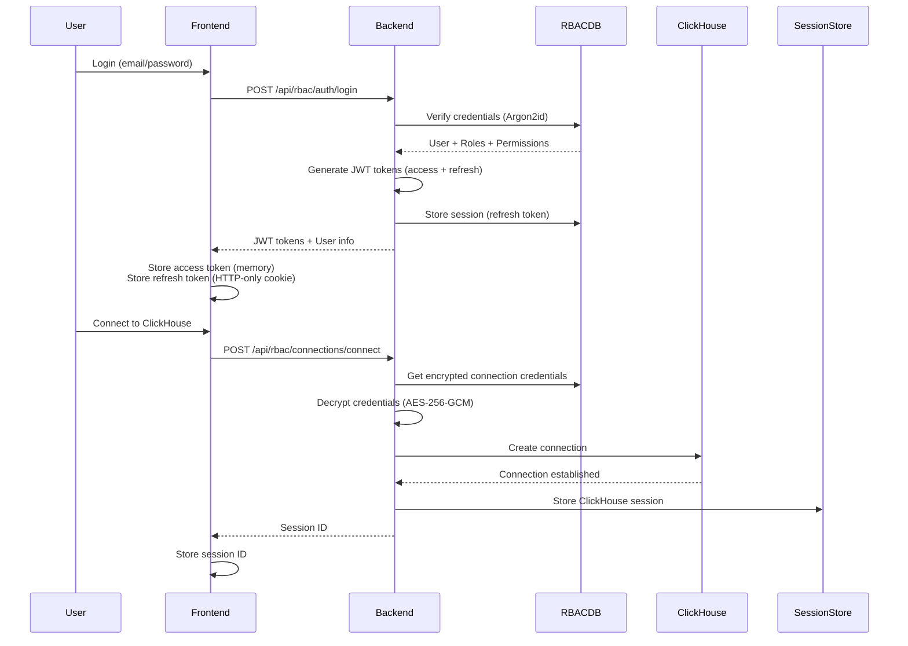
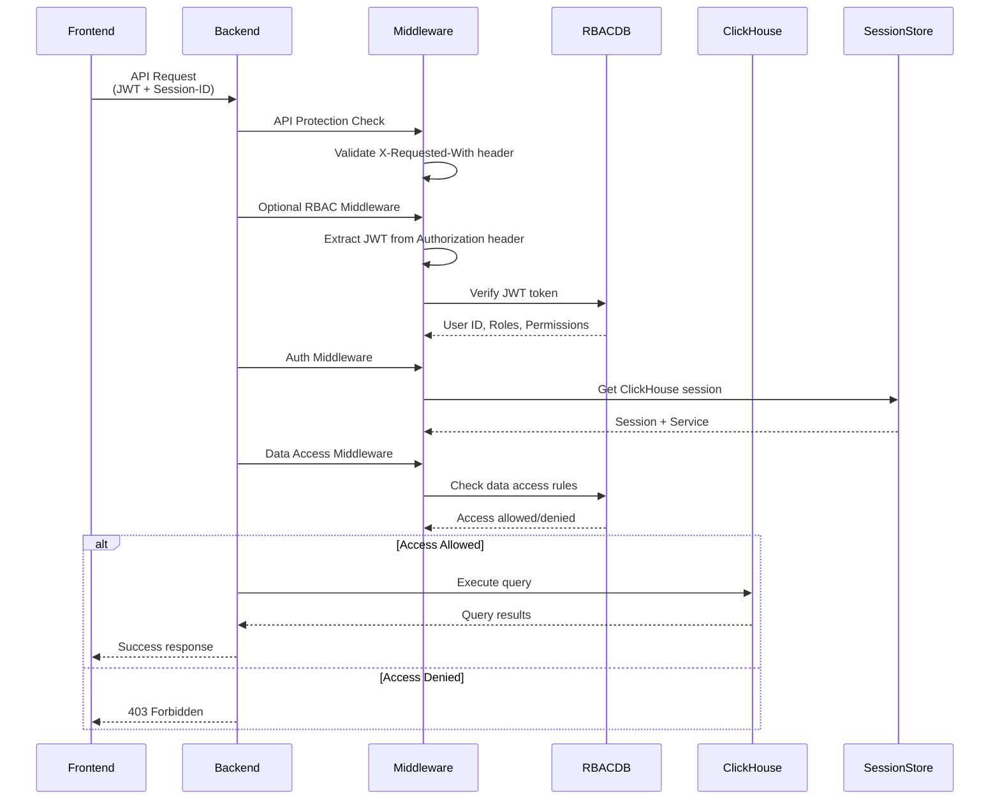

<p align="center">
  
</p>

<h1 align="center">ClickHouse Studio</h1>

<p align="center">
  <strong>A web interface for ClickHouse with built-in RBAC</strong>
</p>

<p align="center">
  <a href="#features">Features</a> •
  <a href="#architecture">Architecture</a> •
  <a href="#quick-start">Quick Start</a> •
  <a href="#deployment">Deployment</a> •
  <a href="#configuration">Configuration</a>
</p>

---

## Overview

ClickHouse Studio is a web interface for managing ClickHouse databases with server-side credential management and **Role-Based Access Control (RBAC)**. Credentials are stored encrypted on the server, and access is controlled through a permission system.

### Why ClickHouse Studio?

ClickHouse Studio provides security and access control features for teams that need:

| Feature | ClickHouse Studio |
|---------|-------------------|
| **Credential Management** | Encrypted server-side storage (never in browser) |
| **Architecture** | Secure backend proxy (no direct browser-to-ClickHouse) |
| **Access Control** | Full RBAC with granular permissions |
| **Multi-Connection** | Manage multiple ClickHouse servers |
| **Audit Trail** | Audit logging |

> **Note**: Other ClickHouse tools serve different use cases well. ClickHouse Studio is designed specifically for teams requiring centralized credential management, role-based access control, and audit capabilities.

---

## Features

### 🔐 Security & Access Control
- **RBAC System** - Role-based permissions (Super Admin, Admin, Developer, Analyst, Viewer)
- **Encrypted Credentials** - AES-256-GCM encryption for ClickHouse connection passwords
- **Password Hashing** - Argon2id for user passwords
- **JWT Authentication** - Secure token-based sessions with access and refresh tokens
- **Data Access Rules** - Granular database/table permissions per user or role
- **Audit Logging** - Track all user actions and query history

### 🗄️ Database Management
- **Multi-Connection Support** - Manage multiple ClickHouse servers
- **Database Explorer** - Tree view with schema inspection
- **Database Operations** - Create and drop databases
- **Table Management** - Create, alter, and drop tables with various engines (MergeTree, ReplicatedMergeTree, etc.)
- **File Upload** - Upload CSV, TSV, or JSON files to existing tables
- **Data Preview** - Sample data with pagination

### 📊 Query & Analytics
- **SQL Editor** - Monaco editor with syntax highlighting and auto-completion
- **Query Execution** - Run queries with execution statistics
- **Query History** - View and filter query logs with auto-refresh
- **Saved Queries** - Persist frequently used queries
- **Data Export** - CSV, JSON, TSV formats
- **Real-time Metrics** - System monitoring dashboard with charts
- **Overview Dashboard** - System stats, recent queries, and quick actions (admin only)

### 🎨 User Experience
- **Modern UI** - Glassmorphism design with dark theme
- **Responsive** - Works on desktop and tablet
- **Connection Selector** - Quick server switching
- **Keyboard Shortcuts** - Power user support

---

## Architecture

```mermaid
graph TB
    subgraph Frontend["Frontend (React + Vite)"]
        Login["Login Page"]
        Overview["Overview Dashboard"]
        Explorer["Explorer"]
        Query["Query Workspace"]
        Metrics["Metrics Dashboard"]
        Logs["Query Logs"]
        Admin["Admin Panel"]
        Settings["Settings"]
        
        APIClient["API Client<br/>(X-Requested-With, JWT, Session-ID)"]
        
        Login --> APIClient
        Overview --> APIClient
        Explorer --> APIClient
        Query --> APIClient
        Metrics --> APIClient
        Logs --> APIClient
        Admin --> APIClient
        Settings --> APIClient
    end
    
    subgraph Backend["Backend (Bun + Hono)"]
        subgraph GlobalMW["Global Middleware"]
            Security["Security Headers"]
            CORS["CORS Middleware"]
            Logging["Request Logging"]
            APIProtection["API Protection<br/>(X-Requested-With)"]
        end
        
        subgraph Routes["API Routes"]
            AuthRoute["/api/auth<br/>(Legacy)"]
            QueryRoute["/api/query"]
            ExplorerRoute["/api/explorer"]
            MetricsRoute["/api/metrics"]
            SavedQueriesRoute["/api/saved-queries"]
            RBACRoutes["/api/rbac<br/>(auth, users, roles,<br/>connections, data-access, audit)"]
        end
        
        subgraph RouteMW["Route Middleware"]
            AuthMW["authMiddleware<br/>(ClickHouse Session)"]
            RBACAuthMW["rbacAuthMiddleware<br/>(JWT Validation)"]
            OptionalRBAC["optionalRbacMiddleware<br/>(Extract JWT if present)"]
            PermissionMW["Permission Checks"]
            DataAccessMW["Data Access Filtering"]
        end
        
        subgraph Services["Services"]
            ClickHouseService["ClickHouseService<br/>(Query Execution)"]
            RBACService["RBAC Service<br/>(Users, Roles, Permissions)"]
            DataAccessService["Data Access Service<br/>(Access Rules)"]
            AuditService["Audit Service<br/>(Logging)"]
        end
        
        subgraph DataStore["Data Stores"]
            RBACDB["RBAC Database<br/>(SQLite/PostgreSQL)<br/>Users, Roles, Permissions,<br/>Connections, Sessions"]
            SessionStore["Session Store<br/>(In-Memory)<br/>ClickHouse Sessions"]
        end
    end
    
    subgraph ClickHouse["ClickHouse Server(s)"]
        CHServer["ClickHouse Database"]
    end
    
    APIClient -->|HTTPS| Security
    Security --> CORS
    CORS --> Logging
    Logging --> APIProtection
    APIProtection --> Routes
    
    AuthRoute --> AuthMW
    QueryRoute --> AuthMW
    QueryRoute --> OptionalRBAC
    QueryRoute --> DataAccessMW
    ExplorerRoute --> AuthMW
    ExplorerRoute --> OptionalRBAC
    ExplorerRoute --> DataAccessMW
    MetricsRoute --> RBACAuthMW
    MetricsRoute --> PermissionMW
    RBACRoutes --> RBACAuthMW
    RBACRoutes --> PermissionMW
    
    AuthMW --> SessionStore
    RBACAuthMW --> RBACDB
    OptionalRBAC --> RBACDB
    PermissionMW --> RBACService
    DataAccessMW --> DataAccessService
    
    QueryRoute --> ClickHouseService
    ExplorerRoute --> ClickHouseService
    MetricsRoute --> ClickHouseService
    
    ClickHouseService --> SessionStore
    ClickHouseService --> RBACDB
    ClickHouseService --> CHServer
    
    RBACService --> RBACDB
    DataAccessService --> RBACDB
    AuditService --> RBACDB
    
    style Frontend fill:#1e1e2e,stroke:#89b4fa
    style Backend fill:#313244,stroke:#f9e2af
    style ClickHouse fill:#45475a,stroke:#a6e3a1
    style RBACDB fill:#585b70,stroke:#fab387
    style SessionStore fill:#585b70,stroke:#fab387
```



### Authentication Flow



### Request Flow



---

## Quick Start

### Prerequisites

- [Bun](https://bun.sh/) v1.0+ (or Node.js 18+)
- A ClickHouse server (or use Docker Compose)

### Tested Compatibility

Successfully tested with:
- **ClickHouse**: Version 25
- **PostgreSQL**: Version 18 (for RBAC database)
- **SQLite**: Version 3.51.0 (via Bun, for RBAC database)

### Development Setup

```bash
# Clone the repository
git clone https://github.com/daun-gatal/clickhouse-studio.git
cd clickhouse-studio

# Install dependencies
bun install

# Start development servers
bun run dev
```

This starts:
- **Frontend**: http://localhost:5173
- **Backend**: http://localhost:5521

### Default Login

On first run, an admin user is created:
- **Email**: `admin@localhost`
- **Password**: `admin123!`

> ⚠️ **Change this password immediately in production!**

---

## Deployment

### Docker (Recommended)

#### Quick Start with SQLite

```bash
# Clone and run
git clone https://github.com/daun-gatal/clickhouse-studio.git
cd clickhouse-studio
docker-compose up -d
```

Access at http://localhost:5521

#### Production with PostgreSQL

```bash
# Use the PostgreSQL compose file
docker-compose -f docker-compose.postgres.yml up -d
```

#### Custom Docker Run

```bash
# Build image
docker build -t clickhouse-studio .

# Run with environment variables
docker run -d \
  -p 5521:5521 \
  -v clickhouse-studio-data:/app/data \
  -e JWT_SECRET=$(openssl rand -base64 32) \
  -e RBAC_ENCRYPTION_KEY=$(openssl rand -hex 32) \
  -e RBAC_ADMIN_PASSWORD="YourSecurePassword123!" \
  clickhouse-studio
```

### Manual Deployment

```bash
# Build frontend
bun run build:web

# Start production server
NODE_ENV=production \
JWT_SECRET=your-secret \
RBAC_ENCRYPTION_KEY=your-key \
bun run packages/server/src/index.ts
```

### Kubernetes

Example deployment manifest:

```yaml
apiVersion: apps/v1
kind: Deployment
metadata:
  name: clickhouse-studio
spec:
  replicas: 2
  selector:
    matchLabels:
      app: clickhouse-studio
  template:
    metadata:
      labels:
        app: clickhouse-studio
    spec:
      containers:
      - name: clickhouse-studio
        image: clickhouse-studio:latest
        ports:
        - containerPort: 5521
        env:
        - name: RBAC_DB_TYPE
          value: "postgres"
        - name: RBAC_POSTGRES_URL
          valueFrom:
            secretKeyRef:
              name: clickhouse-studio-secrets
              key: postgres-url
        - name: JWT_SECRET
          valueFrom:
            secretKeyRef:
              name: clickhouse-studio-secrets
              key: jwt-secret
        - name: RBAC_ENCRYPTION_KEY
          valueFrom:
            secretKeyRef:
              name: clickhouse-studio-secrets
              key: encryption-key
```

---

## Configuration

### Environment Variables

#### Core Settings

| Variable | Description | Default |
|----------|-------------|---------|
| `PORT` | Server port | `5521` |
| `NODE_ENV` | Environment (`development`/`production`) | `development` |
| `CORS_ORIGIN` | Allowed CORS origins | `*` |
| `STATIC_PATH` | Path to frontend build | `./dist` |

#### RBAC Database

| Variable | Description | Default |
|----------|-------------|---------|
| `RBAC_DB_TYPE` | Database type (`sqlite`/`postgres`) | `sqlite` |
| `RBAC_SQLITE_PATH` | SQLite file path | `./data/rbac.db` |
| `RBAC_POSTGRES_URL` | PostgreSQL connection URL | - |
| `RBAC_POSTGRES_POOL_SIZE` | Connection pool size | `10` |

#### Authentication

| Variable | Description | Default |
|----------|-------------|---------|
| `JWT_SECRET` | JWT signing secret | **Required in production** |
| `JWT_ACCESS_EXPIRY` | Access token expiry | `15m` |
| `JWT_REFRESH_EXPIRY` | Refresh token expiry | `7d` |
| `RBAC_ADMIN_PASSWORD` | Initial admin password | `admin123!` |

#### Security

| Variable | Description | Default |
|----------|-------------|---------|
| `RBAC_ENCRYPTION_KEY` | AES-256 key for passwords | **Required in production** |
| `SESSION_TTL` | Session timeout (ms) | `3600000` |

### Generating Secrets

```bash
# Generate JWT secret
openssl rand -base64 32

# Generate encryption key
openssl rand -hex 32

# Generate strong password
openssl rand -base64 16
```

---

## RBAC System

### Role Hierarchy

| Role | Description | Key Permissions |
|------|-------------|-----------------|
| **Super Admin** | Full system access | All permissions |
| **Admin** | Server management | Users, roles, connections |
| **Developer** | Write access | Insert, update, DDL |
| **Analyst** | Read access | Select, export |
| **Viewer** | Read-only | Select only |

### Data Access Rules

Control access to specific databases and tables:

```
Rule: Allow "analyst" role to access "analytics.*"
Rule: Deny "viewer" role from "system.*"
Rule: Allow user "john" to access "sales.orders"
```

Features:
- **Wildcards**: `*` matches any database/table
- **Patterns**: Regex support for complex rules
- **Deny Rules**: Explicit denials take precedence
- **Priority**: Higher priority rules evaluated first

### Permission Categories

- **User Management**: Create, update, delete users
- **Role Management**: Manage roles and permissions
- **Connection Management**: Add/edit ClickHouse connections
- **Query Operations**: Execute queries, DML, DDL
- **Table Operations**: Select, insert, update, delete
- **System**: Audit logs, settings

---

## Project Structure

```
clickhouse-studio/
├── packages/
│   └── server/                 # Backend (Bun + Hono)
│       ├── src/
│       │   ├── index.ts        # Server entry point
│       │   ├── routes/         # API route handlers
│       │   ├── middleware/     # Auth, CORS, error handling
│       │   ├── services/       # Business logic
│       │   ├── rbac/           # RBAC system
│       │   │   ├── db/         # Database (Drizzle ORM)
│       │   │   ├── routes/     # RBAC API routes
│       │   │   ├── services/   # RBAC services
│       │   │   └── schema/     # DB schemas (SQLite/Postgres)
│       │   └── types/          # TypeScript types
│       └── package.json
├── src/                        # Frontend (React + Vite)
│   ├── api/                    # API client
│   ├── components/             # UI components
│   │   ├── common/             # Shared components
│   │   └── ui/                 # shadcn/ui components
│   ├── features/               # Feature modules
│   │   ├── admin/              # Admin panel
│   │   ├── explorer/           # Database explorer
│   │   ├── metrics/            # Metrics dashboard
│   │   ├── rbac/               # RBAC components
│   │   └── workspace/          # Query workspace
│   ├── hooks/                  # Custom React hooks
│   ├── stores/                 # Zustand state stores
│   └── pages/                  # Page components
├── Dockerfile                  # Production Docker image
├── docker-compose.yml          # SQLite deployment
├── docker-compose.postgres.yml # PostgreSQL deployment
└── package.json
```

---

## Security Best Practices

### Production Checklist

- [ ] Generate unique `JWT_SECRET` (min 32 bytes)
- [ ] Generate unique `RBAC_ENCRYPTION_KEY` (32 bytes hex)
- [ ] Change default admin password
- [ ] Set `CORS_ORIGIN` to your domain
- [ ] Use PostgreSQL for multi-instance deployments
- [ ] Enable HTTPS via reverse proxy
- [ ] Configure firewall rules
- [ ] Set up regular backups

### Security Features

| Feature | Description |
|---------|-------------|
| **No Browser Credentials** | ClickHouse passwords never reach the frontend |
| **Encrypted Storage** | AES-256-GCM for ClickHouse connection passwords |
| **Password Hashing** | Argon2id for user passwords |
| **JWT Tokens** | Short-lived access tokens, long-lived refresh tokens |
| **RBAC Enforcement** | Every request checked against permissions |
| **Query Validation** | SQL parsed and validated against data access rules |
| **Audit Logging** | All actions logged with user context |

---

## Database Migrations

### Automatic Migrations

**Migrations run automatically on server startup.** No manual intervention required.

```
Server Start
    │
    ▼
initializeRbac()
    │
    ├── Check current DB version
    ├── Run pending migrations (if any)
    └── Seed defaults (first run only)
```

| Scenario | What Happens |
|----------|--------------|
| **Fresh install** | Creates full schema → Seeds roles, permissions, admin user |
| **Version upgrade** | Detects version diff → Applies only pending migrations |
| **Normal restart** | Version matches → No migrations needed |

### Manual Migration (Optional)

For advanced scenarios (pre-flight checks, debugging), use CLI tools:

```bash
cd packages/server

# Check current status and pending migrations
bun run rbac:status

# Output example:
# Current version: 1.1.0
# Target version: 1.2.0
# Pending migrations:
#   - 1.2.0: user_data_access_rules

# Run migrations manually
bun run rbac:migrate

# Check version only
bun run rbac:version

# Seed default data (if missing)
bun run rbac:seed

# Reset database (⚠️ DESTRUCTIVE - deletes all data!)
CONFIRM_RESET=yes bun run rbac:reset
```

### Upgrading ClickHouse Studio

```bash
# 1. Pull latest version
docker pull ghcr.io/daun-gatal/clickhouse-studio:latest

# 2. Restart container - migrations run automatically
docker-compose up -d

# 3. Check logs for migration status
docker logs clickhouse-studio | grep RBAC
```

Expected output on upgrade:
```
[RBAC] ========================================
[RBAC] Initializing RBAC system...
[RBAC] Database type: sqlite
[RBAC] App version: 1.2.0
[RBAC] ========================================
[RBAC] Current DB version: 1.1.0
[RBAC] Running migration: 1.2.0 - user_data_access_rules
[RBAC] Migration complete
RBAC system ready
```

### Troubleshooting Migrations

| Issue | Solution |
|-------|----------|
| Migration fails | Check logs, ensure DB is accessible |
| Wrong permissions | Ensure volume/file ownership matches container user |
| PostgreSQL connection | Verify `RBAC_POSTGRES_URL` is correct |
| Reset needed | Use `CONFIRM_RESET=yes bun run rbac:reset` |

---

## Contributing

We welcome contributions! Please see our contributing guidelines.

1. Fork the repository
2. Create a feature branch (`git checkout -b feature/amazing`)
3. Make your changes
4. Run tests (`bun test`)
5. Commit (`git commit -m 'Add amazing feature'`)
6. Push (`git push origin feature/amazing`)
7. Open a Pull Request

---

## Acknowledgments

### Special Thanks

**[CH-UI](https://github.com/caioricciuti/ch-ui)** by [Caio Ricciuti](https://github.com/caioricciuti) - This project was inspired by CH-UI's design and user experience.

### Built With

- [ClickHouse](https://clickhouse.com/) - Analytics database
- [Bun](https://bun.sh/) - JavaScript runtime
- [Hono](https://hono.dev/) - Web framework
- [React](https://react.dev/) - UI library
- [Vite](https://vitejs.dev/) - Build tool
- [Drizzle ORM](https://orm.drizzle.team/) - Database ORM
- [Monaco Editor](https://microsoft.github.io/monaco-editor/) - SQL editor
- [AG Grid](https://www.ag-grid.com/) - Data grid
- [shadcn/ui](https://ui.shadcn.com/) - UI components
- [Tailwind CSS](https://tailwindcss.com/) - Styling
- [Zustand](https://zustand-demo.pmnd.rs/) - State management
- [TanStack Query](https://tanstack.com/query) - Data fetching
